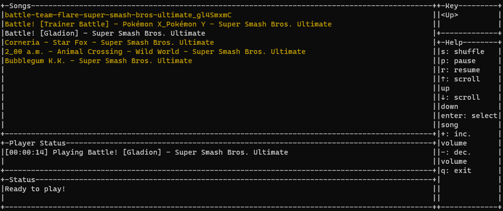

    
    <h1 style="font-family: 'Yu Gothic'">GoBeats</h1>
    
Google Drive Command Line Player

    

# Installation

1. Download the binary for your os.
2. In same folder of the binary, create a config file. Then put your initial configuration there.
3. Start the application on a terminal.

# Commands

| Key            | Description         |
|----------------|---------------------|
| q              | quit                |
| s              | shuffle             |
| enter          | plays selected song |
| up-down arrows | scroll song list    |
| p              | pause               |
| r              | resume              |
