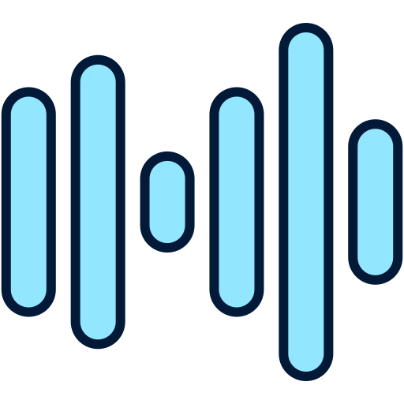

<div align="center">
    
    <h1 style="font-family: 'Yu Gothic'">GoBeats</h1>
    <p style="font-style: italic">Google Drive Command Line Player</p>
</div>

<div>
    
</div>

# Installation

1. Download the binary for your os.
2. In same folder of the binary, create a `config.yml` file. Then put your initial configuration there.
3. In same folder of the binary, create a folder called `storage`.
4. Start the application on a terminal.

## Installation with golang

```bash
go install github.com/jibaru/gobeats/cmd/main@latest
```

# Configuration

You need to make public some Google Drive folder (and your mp3 files you want to read).
Also, you need to generate a Google Drive API Key to fetch initial data.

| Configuration                | Description                   |
|------------------------------|-------------------------------|
| google_drive.root_folder_key | Your Google Drive Folder Key  |
| google_drive.api_key         | Your Google Drive API Key     |
| player.autoplay              | Set autoplay                  |
| player.initial_volume        | Set initial volume (0 to 100) |


# Commands

| Key            | Description         |
|----------------|---------------------|
| q              | quit                |
| s              | shuffle             |
| enter          | plays selected song |
| up-down arrows | scroll song list    |
| p              | pause               |
| r              | resume              |
